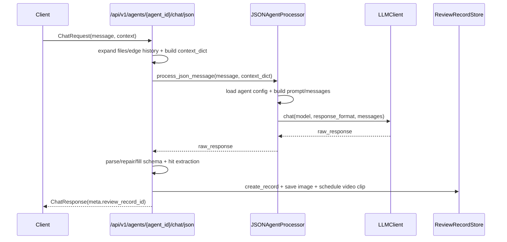
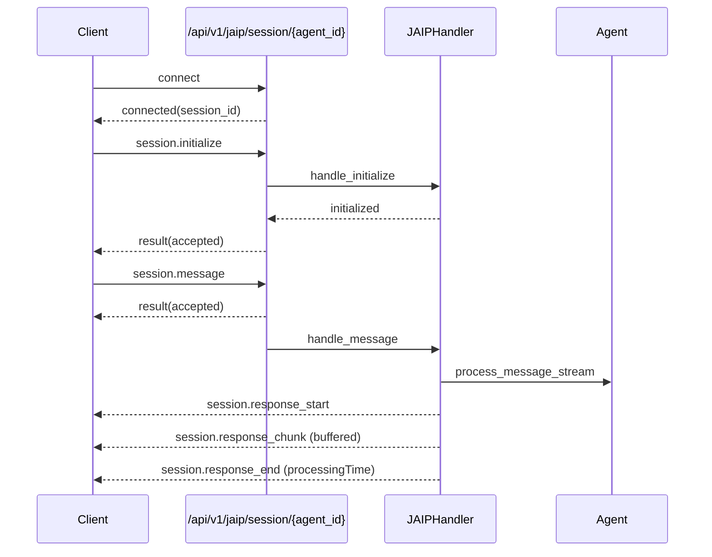
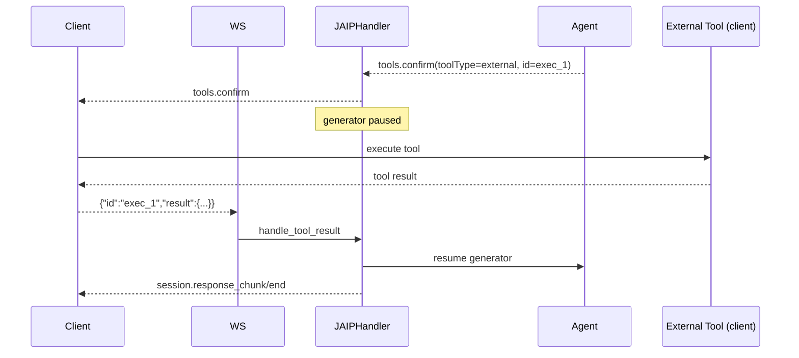
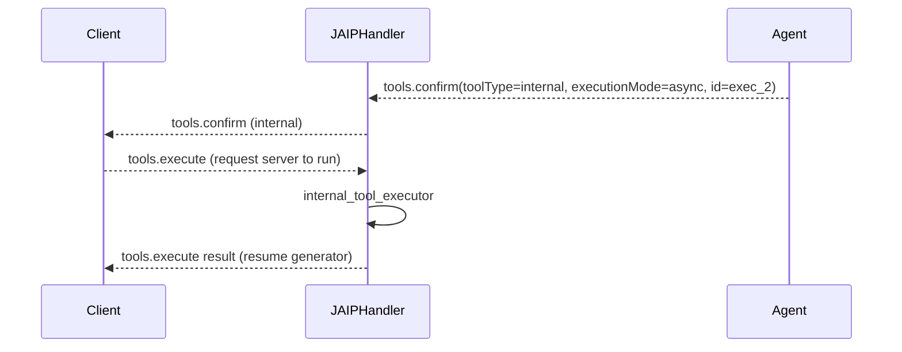

# JetLinks Agent Flows (HTTP JSON + JAIP WebSocket)

本文件整理当前仓库中 **HTTP JSON** 与 **JAIP WebSocket** 的主要调用链路、消息结构与示例。

## HTTP JSON Flow



关键文件：
- `app/api/v1/agents_json.py`
- `app/core/agents/agent_json.py`
- `app/core/llm/client.py`
- `app/services/review_record_service.py`

最小请求示例：
```json
{
  "message": "判断是否有人",
  "context": {
    "files": [{"url": "http://example.com/a.jpg", "media_type": "image"}],
    "output_format": "json",
    "json_schema": {
      "type": "object",
      "properties": {
        "someone": {"type": "boolean"},
        "count": {"type": "integer"}
      }
    }
  }
}
```

最小响应示例：
```json
{
  "success": true,
  "hit": 1,
  "data": {"someone": true, "count": 2},
  "raw_response": "有人，人数为2。",
  "meta": {
    "review_record_id": "b6c3...",
    "review_record_detail": "/api/v1/review-records/b6c3..."
  }
}
```

## JAIP WebSocket Flow (Streaming)



关键文件：
- `app/api/v1/websocket.py`
- `app/core/jaip/handler.py`
- `app/core/agents/cognitive_agent.py`

最小消息样例：
```json
{"jsonrpc":"2.0","id":"init-1","method":"session.initialize","params":{"protocolVersion":"2.0"}}
```

```json
{"jsonrpc":"2.0","id":"msg-1","method":"session.message","params":{"content":"你好","context":{}}}
```

```json
{"jsonrpc":"2.0","method":"session.response_start","params":{"sessionId":"...","responseId":"resp_1","contentType":"stream","messageId":"msg_1"}}
```

```json
{"jsonrpc":"2.0","method":"session.response_chunk","params":{"sessionId":"...","responseId":"resp_1","chunk":{"type":"text","content":"Hello","sequence":0}}}
```

```json
{"jsonrpc":"2.0","method":"session.response_end","params":{"sessionId":"...","responseId":"resp_1","status":"completed","totalChunks":1,"metadata":{"processingTime":1234}}}
```

## JAIP Tool Flow (External Tool)



最小消息样例：
```json
{
  "jsonrpc":"2.0",
  "method":"tools.confirm",
  "id":"exec_1",
  "params":{"call":{"toolName":"search","arguments":{"q":"jetlinks"}},"toolType":"external"}
}
```

```json
{"jsonrpc":"2.0","id":"exec_1","result":{"success":true,"result":{"items":[...]}}}
```

## JAIP Tool Flow (Slow Internal Tool)



最小消息样例：
```json
{"jsonrpc":"2.0","id":"exec_2","method":"tools.execute","params":{"toolName":"internal_x","arguments":{"a":1},"executionId":"exec_2"}}
```

## Tool Registration Normalization (availableTools vs proxyCommands)

JetLinks 平台/Java 中转在 `session.initialize` 时可能下发两种工具结构：

1) **扁平结构（推荐）**：`params.availableTools: ToolDef[]`
2) **分组结构（常见于平台配置）**：`params.tools[].proxyCommands[]`（每个 proxyCommand 既有 `commandId` 也有 `realCommandId`）

为了不改前端/Java，服务端在 `app/api/v1/websocket.py::_normalize_initialize_params()` 做了兼容归一化：

- 若存在 `tools[].proxyCommands[]`：将每个 proxyCommand **展平为一个可执行工具**，合并到 `availableTools`。
- 展平后的 tool id 统一为：`{groupId}#{commandId}`（例如：`visualizationService:project#bgr39i`）。
- 同时生成别名映射写入初始化参数：`params.parameters._tool_aliases`：
  - `"{groupId}#{realCommandId}" -> "{groupId}#{commandId}"`（例如：`visualizationService:project#QueryGenerateTemplateInfo -> visualizationService:project#bgr39i`）
  - 若某个 `realCommandId` 在本次 init 中全局唯一，也会额外写入：`"{realCommandId}" -> "{groupId}#{commandId}"`（便于提示词直接写 `GetTemplateInitMetadata`）。

### 为什么会出现“工具名对不上/总是执行错误”

可视化大屏这类工具经常存在两套命名：

- `realCommandId`：语义化方法名（例如 `GetTemplateInitMetadata` / `FillComponent`）
- `commandId`：平台侧真实可执行的短 id（例如 `9ruwig` / `hqf4up`）

如果提示词/规划器选了 `realCommandId`，但会话里只注册了 `commandId` 工具，就会表现为：

- 工具列表里“只有一个/不全”，或
- 规划器能规划出步骤，但执行时找不到工具、或参数被错误填充

归一化 + `_tool_aliases` 的目的就是：**让提示词写 realCommandId 也能被解析成已注册的 commandId 工具**。

### 外部工具执行时的参数兜底（componentId）

某些外部执行器会校验 `componentId`（常见要求是 `componentId == commandId`），并且可能在 Java/前端侧做“参数白名单”，导致部分字段在 `tools.execute` 往返时被丢弃。

当前服务端做了以下兜底（见 `app/core/jaip/handler.py` / `app/core/agents/cognitive_agent.py`）：

- 规划器/执行器支持按 `_tool_aliases` 将 `toolName` 从 `realCommandId` 映射到 `commandId`。
- `tools.confirm -> tools.execute` 与收到 `tools.execute` 时都会：
  - 合并 confirm 阶段缓存参数 + execute 阶段回传参数（回传优先），避免缺参。
  - 将 `componentId` 同时写入 `params.componentId` 和 `params.arguments.componentId`（并兼容 `component_id` / `component id`）。

### 排查建议（优先看 Python 日志）

只看 Python 日志通常就够定位“Java 实际下发了什么”：

- `🧩 [session.initialize] raw params summary`: 原始入参里是否有 `tools/proxyCommands` 或 `availableTools`
- `🧩 [session.initialize] normalized params summary`: 归一化后 `availableTools_len` 是否正确
- `🧰 [register_session_tools] tool=...`: 实际注册了哪些工具 id（应包含 `...#9ruwig/#565rvz/#hqf4up/#bgr39i` 等）

只有当 Python 的 raw summary 已经显示 **Java 根本没下发工具** 或字段名完全不同，才需要再去看 Java 日志确认中转层丢了哪些字段。
